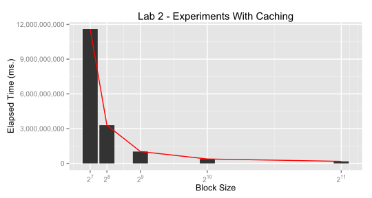
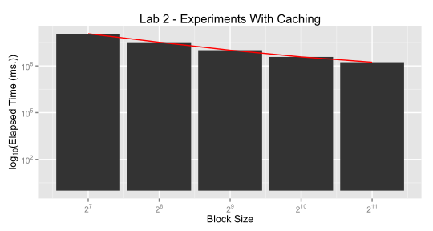

# Robert Smith

## Program 2 - Experiments with Caching

### Experimental Design

The matrices were implemented as 1-dimensional short int arrays, and were initialized outside of the timer. A function was created so that the rows & columns could be easily accessed, and the blocking loop was implemented similarly to the example. The timer was begun after the matrix initialization, and ends immediately after the matrix multiplication is completed. Finally, the experiment was run on the Tesla server. 

### Output

Based on three trials, I found a quite profound & repeatable linear speedup between Block Sizes of $2^2$ and $2^4$, with slower speedups in the ranges of $2^5$ to $2^8$. This speedup, when viewed after a logarithmic transformation appears to be linear and therefore as block size increases by a power of X, time to complete the process in milliseconds appears to fall by a power of Y. From the table below, none of the times were outside a certain range so I don't expect that there will be any extraordinary speedup achieved by moving towards larger block sizes. 

 <TABLE border=1> <TR> <TD><TABLE border=1>
<CAPTION ALIGN="top"> Table of Minimum Elapsed Time </CAPTION>
<TR> <TH>  </TH> <TH> Block_Size </TH> <TH> Elapsed_Time </TH> <TH> exp </TH>  </TR>
  <TR> <TD align="right"> 1 </TD> <TD align="right"> 128 </TD> <TD align="right"> 11609246517.00 </TD> <TD align="right">   1 </TD> </TR>
  <TR> <TD align="right"> 2 </TD> <TD align="right"> 256 </TD> <TD align="right"> 3296317673.00 </TD> <TD align="right">   2 </TD> </TR>
  <TR> <TD align="right"> 3 </TD> <TD align="right"> 512 </TD> <TD align="right"> 1020751918.00 </TD> <TD align="right">   3 </TD> </TR>
  <TR> <TD align="right"> 4 </TD> <TD align="right"> 1024 </TD> <TD align="right"> 378315075.00 </TD> <TD align="right">   4 </TD> </TR>
  <TR> <TD align="right"> 5 </TD> <TD align="right"> 2048 </TD> <TD align="right"> 172620078.00 </TD> <TD align="right">   5 </TD> </TR>
   </TABLE>
</TD> <TD> </TD> <TD><TABLE border=1>
<CAPTION ALIGN="top"> Table of Elapsed Times from All Runs </CAPTION>
<TR> <TH>  </TH> <TH> Block_Size </TH> <TH> Run_1 </TH> <TH> Run_2 </TH> <TH> Run_3 </TH>  </TR>
  <TR> <TD align="right"> 1 </TD> <TD align="right"> 128 </TD> <TD align="right"> 12009457221.00 </TD> <TD align="right"> 11767414877.00 </TD> <TD align="right"> 11609246517.00 </TD> </TR>
  <TR> <TD align="right"> 2 </TD> <TD align="right"> 256 </TD> <TD align="right"> 3371129591.00 </TD> <TD align="right"> 3296317673.00 </TD> <TD align="right"> 3329279572.00 </TD> </TR>
  <TR> <TD align="right"> 3 </TD> <TD align="right"> 512 </TD> <TD align="right"> 1054266209.00 </TD> <TD align="right"> 1020751918.00 </TD> <TD align="right"> 1051972836.00 </TD> </TR>
  <TR> <TD align="right"> 4 </TD> <TD align="right"> 1024 </TD> <TD align="right"> 401296923.00 </TD> <TD align="right"> 378315075.00 </TD> <TD align="right"> 399331565.00 </TD> </TR>
  <TR> <TD align="right"> 5 </TD> <TD align="right"> 2048 </TD> <TD align="right"> 191392568.00 </TD> <TD align="right"> 172620078.00 </TD> <TD align="right"> 186360725.00 </TD> </TR>
   </TABLE>
</TD> </TR> </TABLE> 

### Conclusions

Based on the trials, I estimate that the cache size is around $2 * 2^9 = 2^{10}$ bytes (as short ints are stored as 2-byte data types), so approximately 1 kilobyte. To find this estimate, we see a fairly linear time trend when we look at the logarithmic value of the time it takes to complete the process which suggests that since we don't see a local minimum somewhere outside the left and right side of the graph that we've approached the cache size but not actually surpassed it. 

Based on the fact that each progressively larger block size netted a logarithmic speed increase I believe that the larger a chunk of data we pass through the cache the more it is available to .

